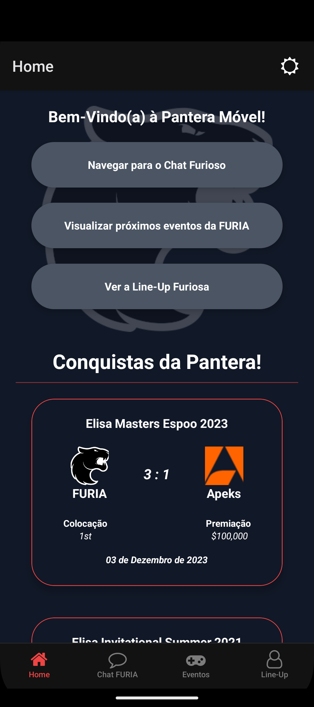
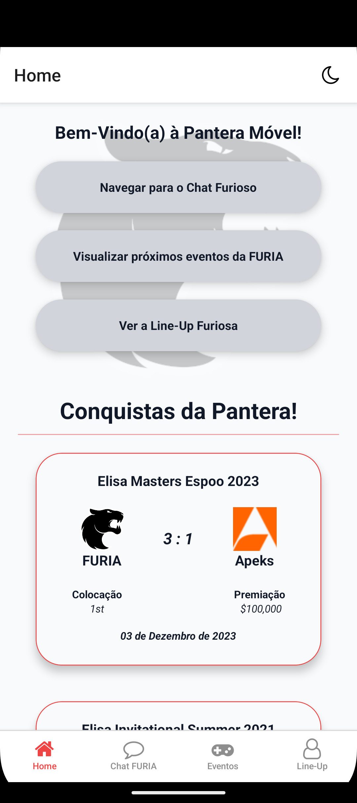
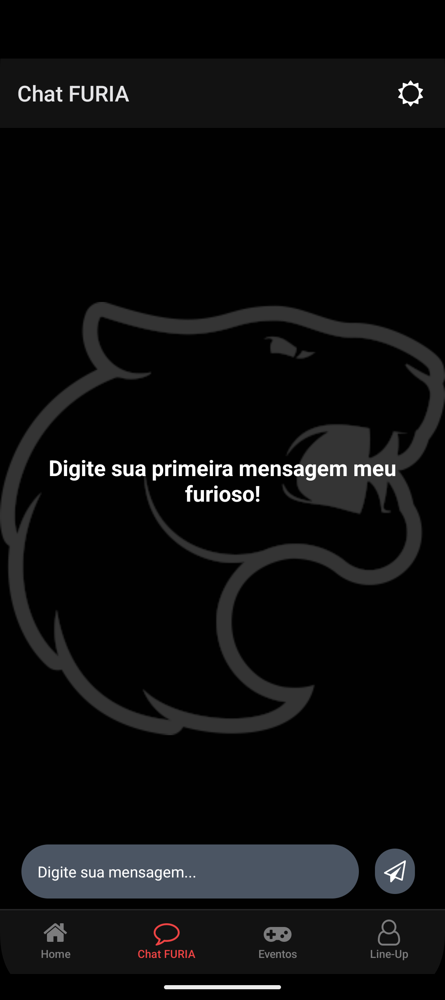
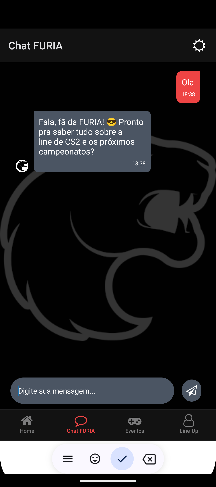

# 🐾 Pantera Móvel - Furia ChatBot

Aplicativo mobile feito com React Native que reúne as principais informações sobre o time de Counter Strike 2 da **FURIA Esports**. A proposta é trazer uma experiência rápida, divertida e interativa para os fãs da organização!

## 📱 Funcionalidades

-   💬 **Chat Furioso** – Converse com nosso bot que responde automaticamente baseado na sua mensagem.
-   🏆 **Títulos da FURIA** – Veja as conquistas do time no cenário competitivo de CS2.
-   🗓️ **Próximos Eventos** – Fique por dentro dos campeonatos e partidas futuras.
-   👥 **Elenco Completo** – Conheça os jogadores titulares, reservas e o coach, com estatísticas e mais.

## 🚀 Tecnologias Utilizadas

-   [React Native](https://reactnative.dev/)
-   [Expo](https://expo.dev/)
-   [Expo Router](https://expo.github.io/router/) – Navegação baseada em arquivos
-   [TypeScript](https://www.typescriptlang.org/)
-   [FontAwesome](https://fontawesome.com/) – Ícones personalizados

## 📦 Instalação

### 1. Pré-requisitos

Instale o Node.js:

-   [Node.js](https://nodejs.org/en/download/)

Instale o Java SDK (versão 17):

-   [JDK 17](https://www.oracle.com/java/technologies/javase/jdk17-archive-downloads.html)

Escolha uma das opções para rodar o app:

-   Emulador Android: [Android Studio](https://developer.android.com/studio?hl=pt-br)
-   Dispositivo físico: [Expo Go (Android)](https://play.google.com/store/apps/details?id=host.exp.exponent&pcampaignid=web_share)

⚙️ Siga este guia de configuração:  
👉 [Configuração do Ambiente React Native](https://reactnative.dev/docs/set-up-your-environment)

### 2. Clonar o repositório

```bash
git clone https://github.com/AbadeMTH/FuriaChatBot.git
cd FuriaChatBot
```

### 3. Instalar as dependências

```bash
npm install
# ou
yarn install
```

### 4. Rodar o projeto

```bash
npm run start #Irá iniciar apenas o Metro
# ou
npm run android #Irá iniciar o Metro e abrirá o emulador caso configurado corretamente
```

Caso queiro utilizar seu dispositivo móvel para verificar o projeto?

-   Abra o aplicativo Expo Go no celular, e escaneie o QR Code gerado pelo Metro
    > Certifique-se de ter o [Expo Go](https://expo.dev/client) instalado no seu celular para testar o app via QR Code.

## 📸 Imagens







## 👨‍💻 Autor

Desenvolvido com 💜 por [AbadeMTH](https://github.com/AbadeMTH)
